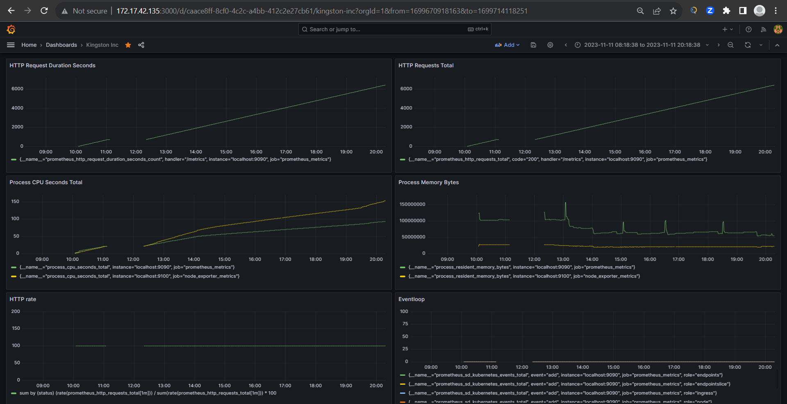

# kingston-inc

## Introduction

The primary objective of this project is to efficiently configure, provision, and monitor Node.js applications, ensuring their smooth deployment, scalability, and observability, while adhering to modern best practices and technologies.

## Tools

[VS Code](https://code.visualstudio.com/)

## Installation

### Pre-requisite
- Ubuntu 22.04
- [Docker](https://docs.docker.com/engine/install/ubuntu/)
- [MicroK8s](https://ubuntu.com/kubernetes/install#tab-linux__content)
- [Devcontainers](https://code.visualstudio.com/docs/devcontainers/containers#_installation)

## Usage

### Build the DevContainer

1. With your project folder open in VS Code, look for the green "Remote-Containers" icon in the lower-left corner of the VS Code window.

   

2. Click on the "Remote-Containers" icon, and a menu will appear. Select "Reopen in Container" from the menu.

   

3. VS Code will now use your existing `devcontainer.json` configuration to build and start the DevContainer for your project.

### Run
```shell
npm start
```

### Run in development mode
```shell
npm run dev
```

### Run the unit test
```shell
npm test
```

## Deployment
Make sure to create a namespace in the kubernetes cluster prior if required and switch the context to it.
Finally, apply the kubernetes files in the order as follows

### Create secrets
```shell
microk8s kubectl apply -f k8s/postgres-secret.yaml
```

### Create configmap
```shell
microk8s kubectl apply -f k8s/postgres-configmap.yaml
```

### Deploy Postgres
```shell
microk8s kubectl apply -f k8s/postgres-deployment.yaml
```

### Deploy app
```shell
microk8s kubectl apply -f k8s/app-deployment.yaml
```

### Create Ingress
```shell
microk8s kubectl apply -f k8s/ingress.yaml
```

## Tests and Validations
We'll be executing curl commands in order to test our deployment. Previously, we have configured our LoadBalancer service to an ingress thus, make sure to define a DNS targeting the deployment with `kingston-inc.com`.

example:
```shell
curl http://kingston-inc.com/api/products
```

Please refer the swagger documentation provided at `docs/swagger/openapi.yaml` for the all implemented REST APIs.

## Monitoring and Observability
For our monitoring purpose we shall make use of [Prometheus](https://prometheus.io/docs/introduction/overview/#what-is-prometheus) and for a really interesting visualization we'll use [Grafana](https://grafana.com/docs/grafana/latest/getting-started/#get-started).
Configure the node_exporter at the kubernetes cluster nodes accordingly and then create dashboard for critical metrices.

